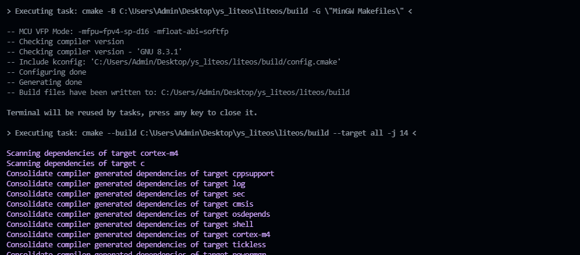

## LiteOS 5.0 CMake Project (default mcu: STM32F407ZG)

## Requirements

- vscode with `ms-vscode.cmake-tools` extensions
- cmake >= 3.20 (**must in your system environment**)
- `MinGW Make` or `ninja` (**must in your system environment**)
- toolchain: `arm-none-eabi 8.3.x` (**must in your system environment**)

***

## Prepare Work

- Open `./.vscode/settings.json` config file and set your **CMake Generator** by modify `cmake.generator` field.

  By default, we use `MinGW Make`

  ```json
  {
      "cmake.generator": "MinGW Makefiles",
      "cmake.buildDirectory": "${workspaceFolder}/build",
      "files.associations": {
          "*.h": "c",
          "*.c": "c",
          ".cpp": "cpp"
      }
  }
  ```

***

## Build Project

- Press shortcuts `Ctrl+Shift+B`, open vscode task list, select `Build` task and run it to build project.

  
